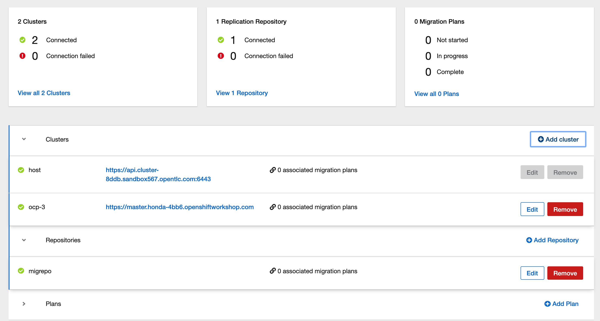
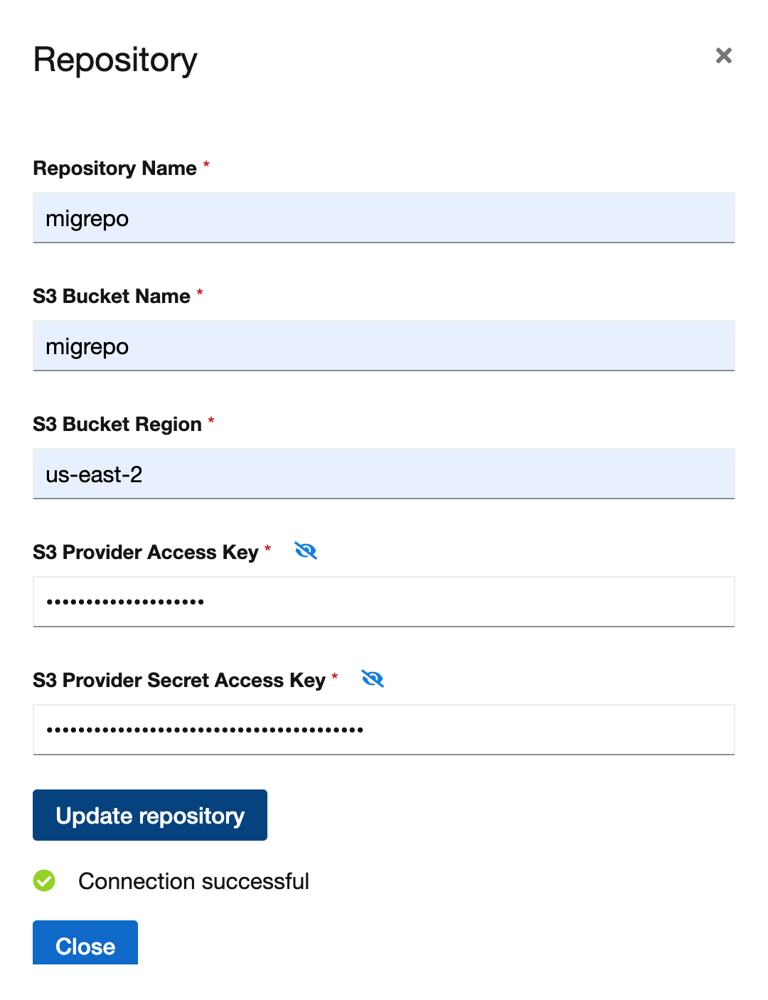
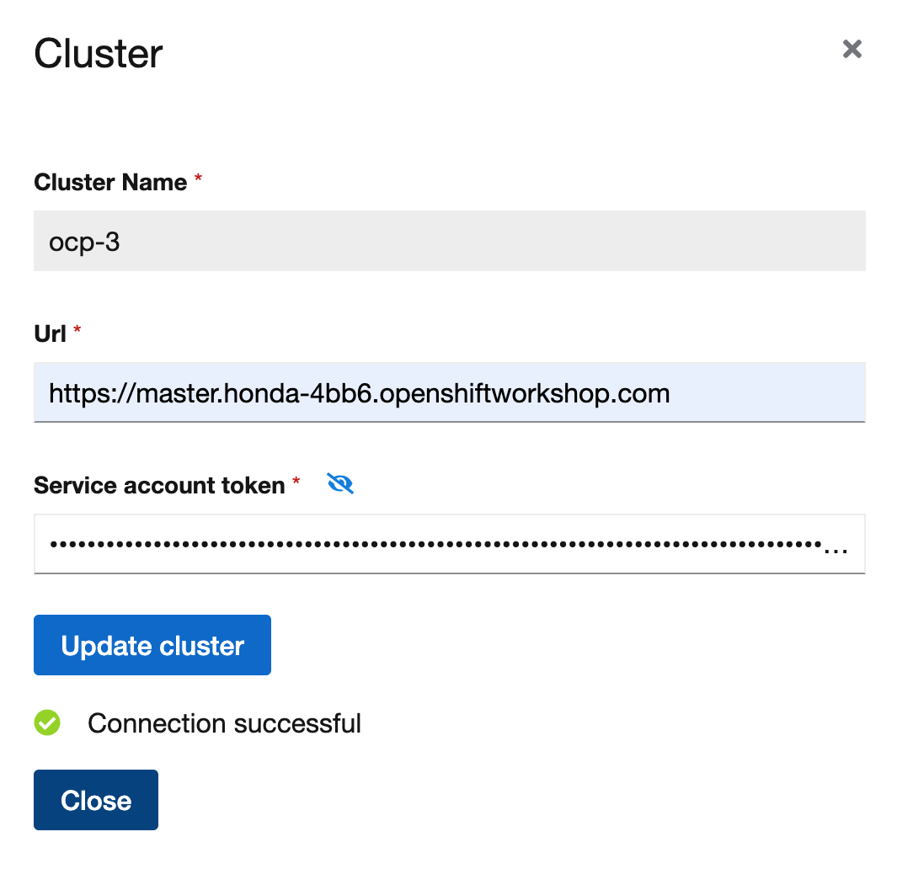
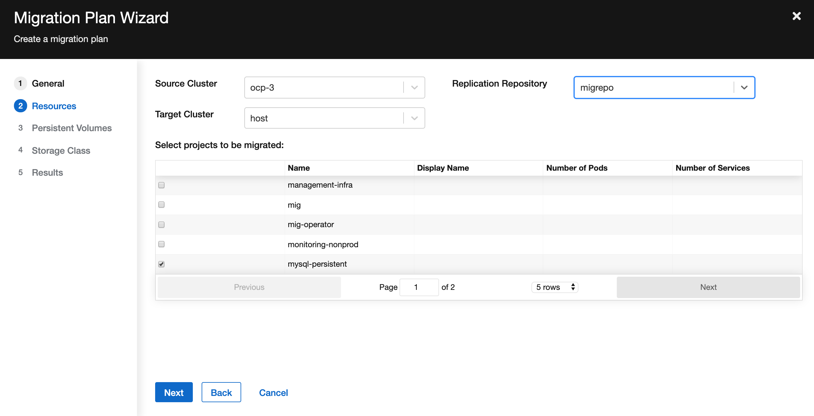
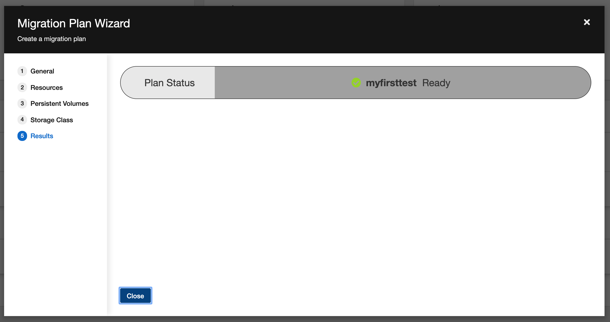
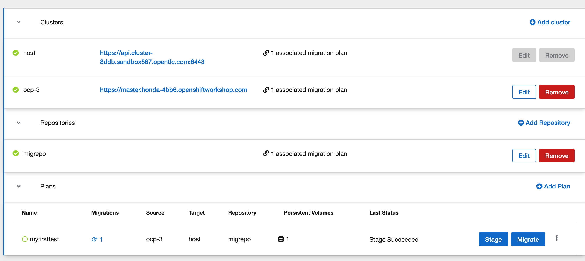
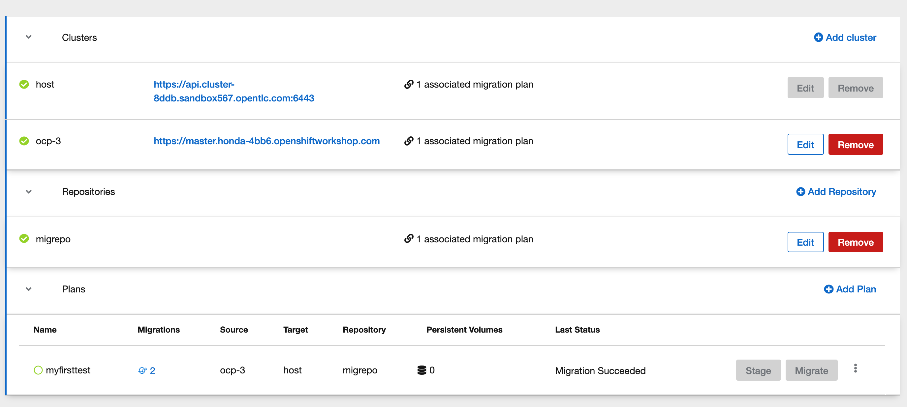

## Testing migration steps

On the 3.x cluster:

```
oc new-project mig-operator
oc create -f https://raw.githubusercontent.com/fusor/mig-operator/master/operator.yml
```

Download the controller.yaml
```
wget https://raw.githubusercontent.com/fusor/mig-operator/master/controller.yml
```

Since we only want to install migration_velero on 3.x cluster, we will need to set migration_controller and migration_ui to false as shown below.

```
apiVersion: migration.openshift.io/v1alpha1
kind: MigrationController
metadata:
  name: migration-controller
  namespace: mig
spec:
  cluster_name: host
  migration_velero: true
  migration_controller: false
  migration_ui: false
```

Deploy the MigrationController

```
oc create -f controller.yml
```

Switch to OCP 4.x cluster

```
oc create -f https://raw.githubusercontent.com/fusor/mig-operator/master/operator.yml
oc create -f https://raw.githubusercontent.com/fusor/mig-operator/master/controller.yml

```
Back onto OCP 3.x cluster, get the hostname from the migration route from instruction per link here.
https://github.com/fusor/mig-operator#manual-cors-cross-origin-resource-sharing-configuration


```
$ oc get -n mig route/migration -o go-template='{{ .spec.host }}{{ println }}'
migration-mig.apps.cluster-8ddb.sandbox567.opentlc.com
```

Login to master and update the /etc/origin/master/master-config.yaml from the previous step.

```
corsAllowedOrigins:
- //$output-from-previous-command
```

Restart the master

```
$/usr/local/bin/master-restart api
$/usr/local/bin/master-restart controllers
```


Create AWS S3 bucket

```
$aws s3 mb s3://migrepo
make_bucket: migrepo
```

(in case you need it) Delete S3 bucket
```
$ aws s3 rb s3://bucket-name --force
```
Switch to OCP 3.x cluster
```
$ oc sa get-token -n mig mig
```

Deploy an sample application on OCP 3.x cluster
```
oc create -f https://raw.githubusercontent.com/fusor/mig-controller/master/docs/scenarios/nfs-pv/mysql-persistent-template.yaml
```

Switch to OCP 4.x
1. Go to Web UI
2. Go to project `mig`
3. Application -> Route --> click on the `hostname`

4. Add repository

5. Add OCP 3 cluster

6. Add plan


7. Stage the application

8. Migrate the application



Migration Tutorial is here: https://github.com/fusor/mig-agnosticd/blob/master/demos/2019_07_Hackfest/Migrate.md

## References:

- https://github.com/fusor/mig-operator
- https://github.com/fusor/mig-demo-apps
- https://github.com/fusor/mig-agnosticd
